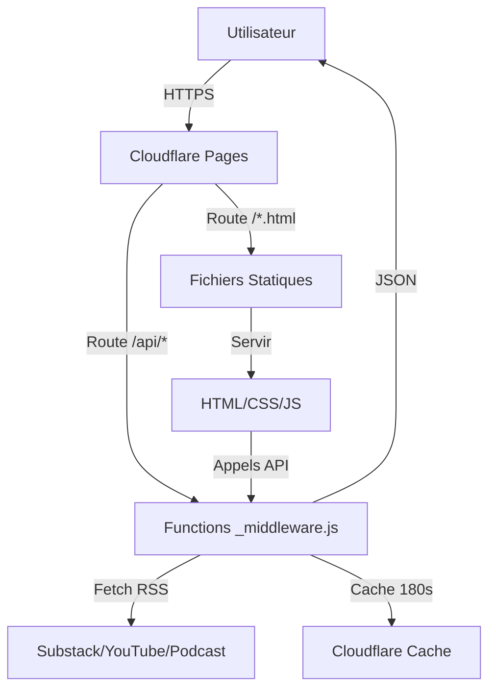

# 🚀 Guide Déploiement Cloudflare Pages

## ✅ Configuration Cloudflare Pages avec Functions

Votre projet est configuré pour **Cloudflare Pages** avec **Functions intégrées**.

### 📁 Structure du Projet

```
ProdBeta/
├── index.html              # Page d'accueil (servie par Pages)
├── admin/                  # Interface admin (servie par Pages)
│   ├── index.html
│   └── dashboard.html
├── core/                   # JavaScript (servi par Pages)
│   ├── admin.js
│   └── frontend.js
├── functions/              # Backend API (Functions Pages)
│   └── _middleware.js      # Gère toutes les routes /api/*
├── _worker.js              # Backup (pas utilisé sur Pages)
└── wrangler.toml           # Configuration
```

---

## 🎯 Déploiement en 3 Étapes

### **Étape 1 : Connexion à Cloudflare**

#### Via Dashboard (Recommandé pour débuter)

1. **Aller sur** : https://dash.cloudflare.com/
2. **Cliquer** : `Workers & Pages` → `Create application`
3. **Choisir** : `Pages` → `Connect to Git`

#### Via CLI (Pour utilisateurs avancés)

```bash
npx wrangler login
```

---

### **Étape 2 : Connexion GitHub**

1. **Autoriser** Cloudflare à accéder à GitHub
2. **Sélectionner** le repo : `StackPagesCMS/ProdBeta`
3. **Configurer** le build :

```yaml
Build command: (laisser vide)
Build output directory: / (racine)
Root directory: (laisser vide ou ProdBeta si monorepo)
```

**Cloudflare Pages ne nécessite PAS de build** car tout est déjà statique !

---

### **Étape 3 : Variables d'Environnement**

Dans le dashboard Cloudflare Pages :

1. **Aller** : Settings → Environment variables
2. **Ajouter** les variables suivantes :

#### Variables Production

```env
ADMIN_EMAIL = votre-email@example.com
ADMIN_PASSWORD = votre_password_securise_minimum_12_chars
SUBSTACK_FEED_URL = https://votre-compte.substack.com/feed
YOUTUBE_FEED_URL = https://www.youtube.com/feeds/videos.xml?channel_id=VOTRE_ID
PODCAST_FEED_URL = https://anchor.fm/s/VOTRE_ID/podcast/rss
FRONTEND_BUILDER_URL = https://apps.webstudio.is/dashboard
META_TITLE = Votre Site
META_DESCRIPTION = Description de votre site
META_KEYWORDS = mots,clés,seo
```

⚠️ **Important** : Marquer `ADMIN_PASSWORD` comme **Encrypted**

---

## 🌐 Après le Déploiement

### URL de production

Votre site sera accessible à :
```
https://stackpages-cms.pages.dev
```

Ou avec un domaine personnalisé :
```
https://votre-domaine.com
```

### Tester que tout fonctionne

#### 1. Page d'accueil
```
https://stackpages-cms.pages.dev/
```
✅ Doit afficher le portail StackPages

#### 2. Login admin
```
https://stackpages-cms.pages.dev/admin/
```
✅ Page de connexion s'affiche

#### 3. API Metadata
```
https://stackpages-cms.pages.dev/api/metadata
```
✅ Retourne un JSON avec infos du site

#### 4. API Posts
```
https://stackpages-cms.pages.dev/api/posts
```
✅ Retourne array JSON des articles Substack

---

## 🔄 Déploiement Automatique

### Git Push → Auto Deploy

Chaque fois que vous poussez sur GitHub :

```bash
git add .
git commit -m "Update CMS"
git push origin main
```

Cloudflare Pages détecte automatiquement et redéploie ! 🎉

### Voir les déploiements

Dashboard → Pages → Votre projet → Deployments

---

## 🛠️ Développement Local

### Tester en local AVANT déploiement

```bash
# Installer Wrangler
npm install -g wrangler

# Créer .dev.vars
cp .dev.vars.example .dev.vars
nano .dev.vars

# Lancer le serveur local
npx wrangler pages dev . --compatibility-date=2024-12-12
```

Accéder à : `http://localhost:8788`

---

## 🎨 Domaine Personnalisé

### Ajouter votre domaine

1. **Dashboard** → Pages → Votre projet → Custom domains
2. **Ajouter** : `www.votre-domaine.com`
3. **Configurer** les DNS (Cloudflare le fait automatiquement si votre domaine est chez eux)

### SSL/HTTPS

✅ **Automatique** ! Cloudflare génère un certificat SSL gratuit.

---

## 📊 Architecture Cloudflare Pages



### Flux de requête

1. **Requête** arrive sur `stackpages-cms.pages.dev`
2. **Pages regarde** le path :
   - `/api/*` → Envoyé à `functions/_middleware.js`
   - `/*.html`, `/admin/*`, etc. → Fichiers statiques servis directement
3. **Function** (_middleware.js) :
   - Traite les routes API
   - Fetch les flux RSS
   - Cache les résultats (180s)
   - Retourne JSON
4. **Admin.js** (frontend) :
   - Appelle `/api/posts`, `/api/videos`, etc.
   - Affiche dans le dashboard

---

## ⚙️ Configuration Avancée

### Limites Cloudflare Pages (Plan Gratuit)

| Ressource | Limite |
|-----------|--------|
| Requêtes/jour | 100 000 |
| Bandwidth | Illimité |
| Build time | 20 min |
| Functions CPU time | 10ms par requête |

**Largement suffisant pour un CMS** ! 🎉

### Monitoring

Dashboard → Pages → Analytics

Voir :
- Nombre de requêtes
- Temps de réponse
- Erreurs

### Logs en temps réel

```bash
npx wrangler pages deployment tail
```

---

## 🐛 Dépannage

### ❌ Functions ne se déploient pas

**Vérifier** :
- Dossier `functions/` existe dans le repo
- Fichier `functions/_middleware.js` présent
- Pas d'erreurs de syntaxe JavaScript

### ❌ Variables d'environnement non trouvées

**Solution** :
1. Dashboard → Settings → Environment variables
2. Vérifier que TOUTES les variables sont définies
3. Redéployer : Deployments → Retry deployment

### ❌ CORS errors

Les headers CORS sont déjà configurés dans `_middleware.js` :

```javascript
corsHeaders = {
    'Access-Control-Allow-Origin': '*',
    'Access-Control-Allow-Methods': 'GET, POST, OPTIONS',
    'Access-Control-Allow-Headers': 'Content-Type'
}
```

Si problème persiste, vérifier la console browser (F12).

### ❌ Cache ne se rafraîchit pas

**Options** :
1. Attendre 3 minutes (TTL = 180s)
2. Dashboard admin → Configuration → Vider le cache
3. Purger via Dashboard CF : Caching → Configuration → Purge Everything

---

## 🔐 Sécurité Production

### Checklist avant mise en production

- [ ] `ADMIN_PASSWORD` fort (minimum 12 caractères)
- [ ] `ADMIN_PASSWORD` marqué comme Encrypted
- [ ] `.dev.vars` dans `.gitignore` (déjà fait)
- [ ] Secrets jamais committés dans Git
- [ ] 2FA activé sur compte Cloudflare
- [ ] Domaine personnalisé configuré (optionnel)
- [ ] SSL/HTTPS actif (automatique)

---

## 📝 Différences avec Workers Standalone

| Feature | Cloudflare Workers | Cloudflare Pages |
|---------|-------------------|------------------|
| Fichiers statiques | ❌ Pas natif | ✅ Intégré |
| Functions | ✅ Oui | ✅ Dans /functions/ |
| Domaine | *.workers.dev | *.pages.dev |
| Git deploy | ❌ Manual | ✅ Automatique |
| Build system | ❌ Non | ✅ Oui |

**Pages = Workers + Static Hosting + Git Integration** 🎉

---

## 🚀 Commandes Utiles

```bash
# Dev local avec Pages
npx wrangler pages dev .

# Dev local avec port custom
npx wrangler pages dev . --port 3000

# Logs en temps réel (production)
npx wrangler pages deployment tail

# Lister vos projets Pages
npx wrangler pages project list

# Deployer manuellement (si pas via Git)
npx wrangler pages deploy .
```

---

## 🎉 Résultat Final

Vous avez maintenant :

✅ **Frontend statique** (HTML/CSS/JS) servi par Cloudflare Pages  
✅ **Backend API** (Functions) dans le même domaine  
✅ **Pas de CORS** car tout sur le même domaine  
✅ **Auto-deploy** via Git push  
✅ **SSL gratuit** et automatique  
✅ **CDN global** ultra-rapide  
✅ **Gratuit** (plan généreux)  

Votre CMS est **production-ready** ! 🎊

---

## 📞 Support

- 📖 **Docs Cloudflare Pages** : https://developers.cloudflare.com/pages/
- 📖 **Docs Functions** : https://developers.cloudflare.com/pages/functions/
- 💬 **Discord Cloudflare** : https://discord.gg/cloudflaredev

---

_Dernière mise à jour : 2025-12-12_
