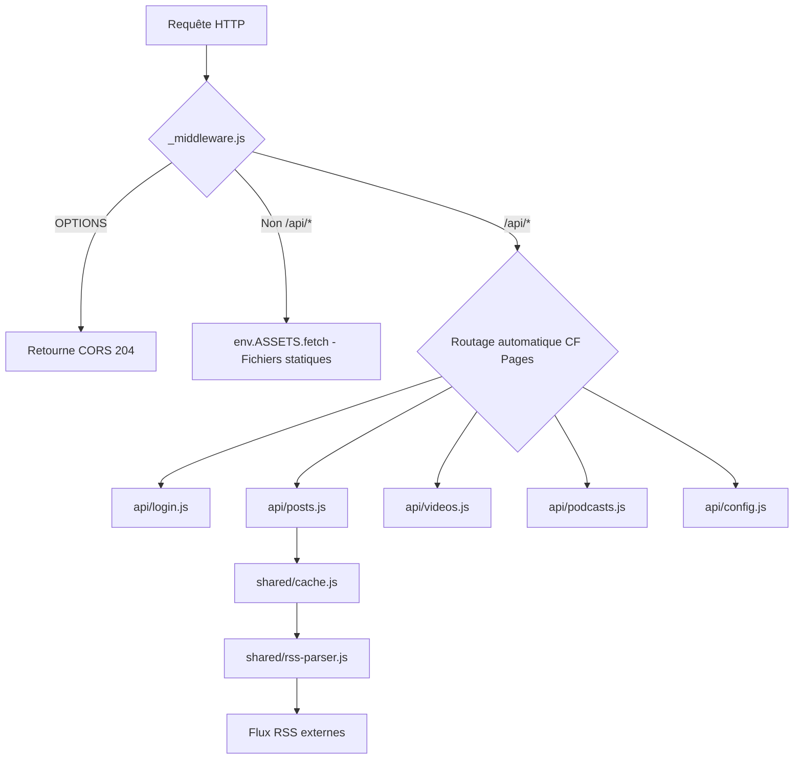

# 🏗️ Architecture Microservices - iziWebCMS

## ✨ Structure Complète

Votre CMS utilise maintenant une **architecture microservices** avec un fichier par route API.

```
functions/
├── _middleware.js              # Middleware global (CORS + passthrough)
├── shared/                     # Modules partagés
│   ├── utils.js                # Fonctions utilitaires
│   ├── rss-parser.js           # Parsing RSS (Substack, YouTube, Podcasts)
│   └── cache.js                # Gestion cache Cloudflare
└── api/                        # Routes API (microservices)
    ├── login.js                # POST /api/login
    ├── logout.js               # GET /api/logout
    ├── metadata.js             # GET /api/metadata
    ├── posts.js                # GET /api/posts
    ├── post/
    │   └── [slug].js           # GET /api/post/:slug
    ├── videos.js               # GET /api/videos
    ├── video/
    │   └── [id].js             # GET /api/video/:id
    ├── podcasts.js             # GET /api/podcasts
    ├── podcast/
    │   └── [id].js             # GET /api/podcast/:id
    ├── config.js               # GET /api/config (protégé)
    └── clear-cache.js          # POST /api/clear-cache (protégé)
```

---

## 📋 Inventaire des Modules

### Modules Partagés (`shared/`)

#### **`utils.js`** - Fonctions utilitaires
- `slugify()` - Génère des slugs URL-friendly
- `decodeHTMLEntities()` - Décode entités HTML
- `extractFirstImage()` - Extrait image d'un HTML
- `extractEnclosureImage()` - Extrait image d'enclosure RSS
- `cleanHtmlContent()` - Nettoie HTML (supprime classes indésirables)
- `corsHeaders` - Headers CORS standards
- `isAuthenticated()` - Vérifie auth via header
- `jsonResponse()` - Retourne JSON avec CORS
- `errorResponse()` - Retourne erreur JSON

#### **`rss-parser.js`** - Parsing RSS
- `extractChannelMetadata()` - Métadonnées canal RSS
- `parseSubstackRSS()` - Parse articles Substack
- `parseYoutubeRSS()` - Parse vidéos YouTube
- `parsePodcastRSS()` - Parse épisodes podcast

#### **`cache.js`** - Cache Cloudflare
- `getCachedRSSData()` - Cache articles Substack
- `getCachedYoutubeData()` - Cache vidéos YouTube
- `getCachedPodcastData()` - Cache podcasts
- TTL: 180 secondes (3 minutes)

---

### Routes API (`api/`)

| Fichier | Méthode | Route | Auth | Description |
|---------|---------|-------|------|-------------|
| `login.js` | POST | `/api/login` | ❌ | Authentification |
| `logout.js` | GET | `/api/logout` | ❌ | Déconnexion |
| `metadata.js` | GET | `/api/metadata` | ❌ | Métadonnées site |
| `posts.js` | GET | `/api/posts` | ❌ | Liste articles |
| `post/[slug].js` | GET | `/api/post/:slug` | ❌ | Article unique |
| `videos.js` | GET | `/api/videos` | ❌ | Liste vidéos |
| `video/[id].js` | GET | `/api/video/:id` | ❌ | Vidéo unique |
| `podcasts.js` | GET | `/api/podcasts` | ❌ | Liste podcasts |
| `podcast/[id].js` | GET | `/api/podcast/:id` | ❌ | Podcast unique |
| `config.js` | GET | `/api/config` | ✅ | Configuration |
| `clear-cache.js` | POST | `/api/clear-cache` | ✅ | Vider cache |

---

## 🔄 Flux de Requête



---

## 🎯 Avantages Architecture Microservices

### ✅ Maintenabilité
- **Un fichier = une responsabilité**
- Code facile à trouver et modifier
- Tests unitaires par route possibles

### ✅ Scalabilité
- Chaque route peut évoluer indépendamment
- Ajout de nouvelles routes simple (nouveau fichier)
- Pas de fichier monolithique de 600+ lignes

### ✅ Performance
- Cloudflare charge uniquement le code nécessaire
- Cold start plus rapide
- Modules partagés mis en cache

### ✅ Collaboration
- Plusieurs développeurs peuvent travailler simultanément
- Moins de conflits Git
- Code review plus facile (petit fichier)

### ✅ Sécurité
- Isolation des routes protégées
- Auth vérifiée uniquement où nécessaire
- Pas de code inutile chargé

---

## 📖 Comment ça fonctionne ?

### Cloudflare Pages Functions - Routing Automatique

Cloudflare Pages mappe automatiquement :

```
functions/api/login.js         → /api/login
functions/api/posts.js         → /api/posts
functions/api/post/[slug].js   → /api/post/mon-article
functions/api/video/[id].js    → /api/video/abc123
```

### Handlers d'Export

Chaque fichier exporte des fonctions selon la méthode HTTP :

```javascript
// api/posts.js
export async function onRequestGet(context) {
    // GET /api/posts
}

export async function onRequestPost(context) {
    // POST /api/posts
}
```

### Paramètres Dynamiques

Les dossiers entre crochets `[]` deviennent des paramètres dynamiques :

```javascript
// api/post/[slug].js
export async function onRequestGet(context) {
    const slug = context.params.slug; // Extrait du chemin
    // ...
}
```

---

## 🔧 Développement Local

### Tester une route spécifique

```bash
# Lancer le serveur Pages dev
npx wrangler pages dev . --compatibility-date=2024-12-12

# Tester une route
curl http://localhost:8788/api/posts
curl http://localhost:8788/api/post/mon-article
curl http://localhost:8788/api/videos
```

### Debug

Ajoutez `console.log()` dans n'importe quel fichier :

```javascript
// api/posts.js
export async function onRequestGet(context) {
    console.log('GET /api/posts appelé');
    // ...
}
```

Voir les logs :
```bash
npx wrangler pages deployment tail
```

---

## 🆕 Ajouter une Nouvelle Route

### Étape 1 : Créer le fichier

```bash
# Exemple : GET /api/comments
touch functions/api/comments.js
```

### Étape 2 : Implémenter le handler

```javascript
// functions/api/comments.js
import { jsonResponse } from '../shared/utils.js';

export async function onRequestGet(context) {
    const comments = [
        { id: 1, text: "Super article !" },
        { id: 2, text: "Merci pour ce contenu" }
    ];
    
    return jsonResponse(comments);
}
```

### Étape 3 : Tester

```bash
curl http://localhost:8788/api/comments
```

**C'est tout !** Cloudflare Pages détecte automatiquement la nouvelle route. 🎉

---

## 🔒 Routes Protégées

Les routes protégées utilisent `isAuthenticated()` :

```javascript
// api/config.js
import { isAuthenticated, jsonResponse, errorResponse } from '../shared/utils.js';

export async function onRequestGet(context) {
    const { request, env } = context;

    // Vérifier auth
    if (!isAuthenticated(request, env)) {
        return errorResponse("Non autorisé", 401);
    }

    // Code protégé
    return jsonResponse({ secret: "data" });
}
```

**Appel avec auth** :
```bash
curl -H "X-Auth-Key: votre_password" \
     http://localhost:8788/api/config
```

---

## 📊 Comparaison Avant/Après

| Critère | Avant (Monolithe) | Après (Microservices) |
|---------|-------------------|----------------------|
| Fichiers | 1 x 663 lignes | 14 x ~20-50 lignes |
| Maintenabilité | ⚠️ Difficile | ✅ Facile |
| Tests | ⚠️ Complexe | ✅ Simple |
| Collaboration | ⚠️ Conflits Git | ✅ Parallélisable |
| Performance | ✅ Identique | ✅ Identique |
| Clarté | ⚠️ Tout mélangé | ✅ Organisé |

---

## 🚀 Déploiement

### Aucun changement !

L'architecture microservices fonctionne **sans modification** sur Cloudflare Pages :

```bash
# Déployer
npx wrangler pages deploy .

# Cloudflare détecte automatiquement :
# - Le dossier functions/
# - Les routes API
# - Les paramètres dynamiques []
```

---

## 🧪 Tests

### Test manuel de toutes les routes

```bash
# Routes publiques
curl http://localhost:8788/api/metadata
curl http://localhost:8788/api/posts
curl http://localhost:8788/api/post/test-slug
curl http://localhost:8788/api/videos
curl http://localhost:8788/api/video/abc123
curl http://localhost:8788/api/podcasts
curl http://localhost:8788/api/podcast/guid-123

# Routes protégées
curl -H "X-Auth-Key: admin" http://localhost:8788/api/config
curl -X POST -H "X-Auth-Key: admin" http://localhost:8788/api/clear-cache
```

---

## 📝 Best Practices

###  1. Garder les routes minimalistes

Chaque route fait **une seule chose**. Complexité dans `shared/`.

### ✅ 2. Réutiliser `shared/utils.js`

Toujours utiliser `jsonResponse()` et `errorResponse()` pour cohérence.

### ✅ 3. Gérer les erreurs

```javascript
try {
    // Code
} catch (e) {
    return errorResponse(e.message, 500);
}
```

### ✅ 4. Documenter les paramètres

```javascript
/**
 * GET /api/post/:slug
 * @param {string} slug - Slug de l'article
 * @returns {Object} Article complet
 */
export async function onRequestGet(context) {
    // ...
}
```

### ✅ 5. Valider les inputs

```javascript
const slug = context.params.slug;
if (!slug || slug.length < 3) {
    return errorResponse("Slug invalide", 400);
}
```

---

## 🎊 Résultat

Votre CMS a maintenant une **architecture professionnelle** :

- ✅ **14 fichiers microservices** (vs 1 monolithe)
- ✅ **Code DRY** (modules partagés)
- ✅ **Maintenable** (facile à modifier)
- ✅ **Testable** (fichiers isolés)
- ✅ **Scalable** (ajout de routes simple)

**Prêt pour la production !** 🚀

---

_Documentation générée le : 2025-12-12_  
_Version : 3.0.0 (Architecture Microservices)_
